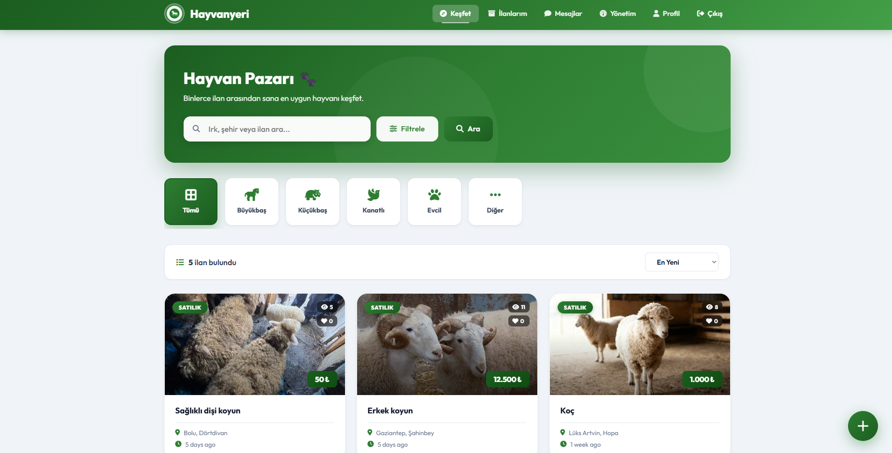
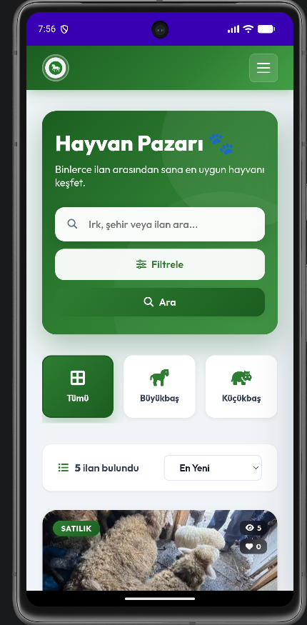
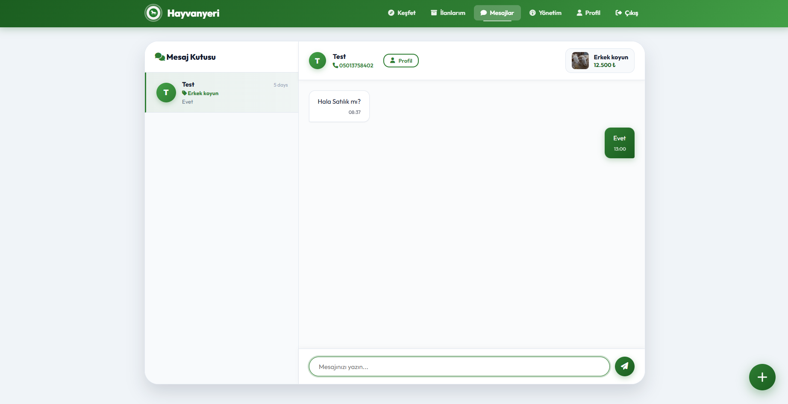
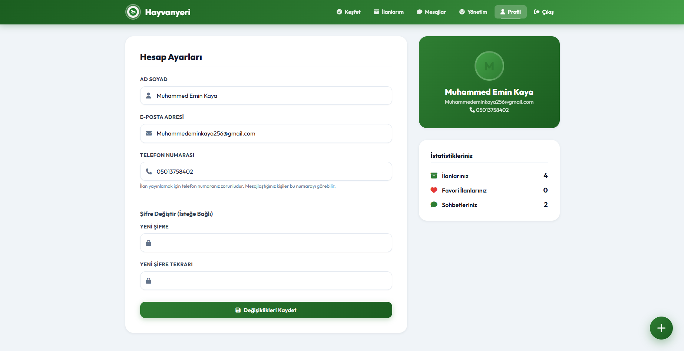

# HayvanPazari-web-app-Showcase
# 🐄 HayvanPazari

HayvanPazari, büyükbaş, küçükbaş, kanatlı ve evcil hayvan ilanlarının yayınlanabildiği, alıcı ve satıcıların doğrudan iletişime geçebildiği web ve mobil destekli bir hayvan pazarlama platformudur.

## 📌 Proje Hakkında

Platform, hayvan yetiştiricileri ve alıcıları tek bir noktada buluşturmayı amaçlar. Kullanıcılar ilan oluşturabilir, ilanları inceleyebilir, diğer kullanıcılarla mesajlaşabilir ve hayvan alım-satım süreçlerini kolayca yönetebilir.

## 🚀 Özellikler

### 👤 Kullanıcı Sistemi

* Kayıt olma ve giriş yapma
* Profil yönetimi
* Yetkilendirme sistemi

### 📢 İlan Yönetimi

* Hayvan ilanı oluşturma
* İlan düzenleme ve silme
* İlan görsel yükleme
* Kategori bazlı listeleme
* İlan arama ve filtreleme

### 💬 Mesajlaşma Sistemi

* Kullanıcılar arası özel mesajlaşma
* İlan sahibi ile doğrudan iletişim
* Mesaj geçmişi görüntüleme

### 🐑 Hayvan Kategorileri

* Büyükbaş
* Küçükbaş
* Kanatlı
* Evcil Hayvanlar

### 📱 Mobil Destek

* Responsive tasarım
* Mobil cihaz uyumluluğu
* Hızlı ve kullanıcı dostu arayüz

## 🛠 Kullanılan Teknolojiler

* Laravel
* MySQL
* Blade
* Bootstrap
* JavaScript
* AJAX

## 📷 Ekran Görüntüleri

### Ana Sayfa

### Mesaj Bölümü

### Profil Bölümü

## 🎯 Amaç

Hayvan alım-satım süreçlerini dijital ortama taşıyarak alıcı ve satıcıların güvenli, hızlı ve kolay şekilde iletişim kurmasını sağlamak.

## ⚠️ Not

Bu repo portföy (showcase) amacıyla oluşturulmuştur. Kaynak kodlar paylaşılmamaktadır.

## Geliştirici
Emin Kaya

GitHub: @EminKY